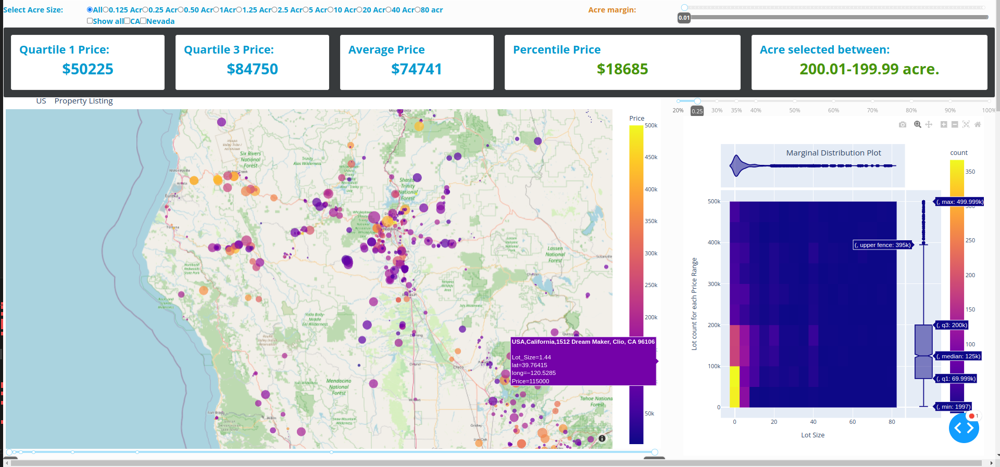

# LandSin

  
## Overview

**LandSin** is a powerful application designed to to analyze land pricing and predicting a land value for a particular area and several statistical analysis about the land to make a decision weather the land could be affordable or habitable for you.

## Table of Contents

- [Features](#features)
- [Technologies Used](#technologies-used)
- [Getting Started](#getting-started)
- [Installation](#installation)
- [Usage](#usage)
- [Contributing](#contributing)
- [License](#license)
- [Contact](#contact)

## Features

- User-friendly interface for Analyzing  land data and getting insights about a particular land and its value for deciding weather you should buy or not.
- Feature 1: Statistical price range and comparing price with existing real estate company
- Feature 2: Predicting the price to buy and selling price estimation for lists of lands. 
- Feature 3: getting the insights weather the land is flat and habitable via google map and feature of land like schooling rate for a particular are.  

## Technologies Used

- **Programming Language**: Python
- **Framework**:  Flask, python plotly Dash

- **Other Libraries**: scikit-learn, NumPy, Pandas, plotly 

## Getting Started

Follow these instructions to get a copy of the project up and running on your local machine for development and testing purposes.

### Prerequisites

Make sure you have the following installed on your machine:

- [Python](https://www.python.org/downloads/) (version 3.x)
- [pip](https://pip.pypa.io/en/stable/) (Python package installer)

### Installation

1. **Clone the repository:**

   ```bash
   git clone https://github.com/alauddin-sabari/LandSin.git
   ```

2. **Navigate into the project directory:**

   ```bash
   cd LandSin
   ```

3. **Install the required packages:**

   ```bash
   pip install -r requirements.txt
   ```

## Usage

After installing the dependencies, you can run the application:

- **On Windows:**

   ```bash
   python main.py
   ```

- **On Linux or macOS:**

   ```bash
   python3 main.py
   ```

### Example Usage

 For a government or a real estate agency can heavily use it to deveop a particular area for making it habitable and any person also can avoid losing their money or pay overprice for an area.

## Contributing

Contributions are welcome! Please follow these steps to contribute to the project:

1. Fork the repository.
2. Create a new branch (`git checkout -b feature/YourFeature`).
3. Make your changes.
4. Commit your changes (`git commit -m 'Add some feature'`).
5. Push to the branch (`git push origin feature/YourFeature`).
6. Open a pull request.

Please ensure your code adheres to the project's coding standards and includes appropriate tests.

## License

This project is licensed under the MIT License - see the [LICENSE](LICENSE) file for details.

## Contact

For any inquiries, suggestions, or feedback, please reach out to:

- **Name**: [Alauddin Sabari]
- **Email**: [aladinsabari@gmail.com]
- **GitHub**: [Your GitHub Profile](https://github.com/alauddin-sabari)

 
